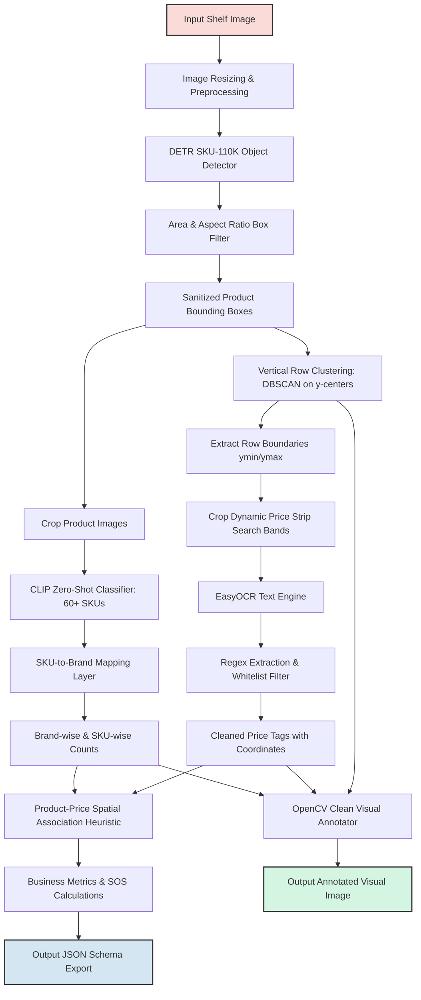

# Retail Shelf Analysis ML Inference Pipeline

A modular, clean, and practical machine learning inference pipeline designed to analyze retail shelf images and generate retail intelligence insights. This prototype solves the retail shelf intelligence case study: **"Analyze shelf images and generate product/brand-wise shelf presence, price tag OCR extraction, product-price mapping, and product availability insights."**

---

## Architecture Diagram

The system operates as a multi-stage pipeline, leveraging specialized deep learning models and geometric heuristics:



---

## Pipeline Core Features & Upgrades

1. **Product Detection & Box Filtering**:
   * Model: `is36e/detr-resnet-50-sku110k` (specifically trained on retail shelves to handle tightly packed and overlapping products).
   * Box filtering: Discards bounding boxes with area $< 100\text{ px}$ or dimension side $< 10\text{ px}$ in inference space to remove false positives.
   * Auto-resizes high-resolution images to a max dimension of `1280 px` while keeping the original aspect ratio for stability.

2. **Product-Level Classification & Brand Mapping**:
   * Uses `openai/clip-vit-base-patch32` with a robust vocabulary of **60+ product SKUs** across beverages, dairy, snacks, and biscuits.
   * Uses engineered descriptive prompts (e.g. `"a supermarket shelf product image of yellow Lay's Classic chips bag"`) to boost CLIP zero-shot classification accuracy.
   * Applies an SKU-to-brand mapping layer to resolve parent brands (`Coca-Cola`, `Pepsi`, `Lay's`, `Doritos`, or `Other`), bypassing the huge "Other" category clutter.
   * Employs a classification confidence threshold of `0.4`. Below this, items are fallback-assigned to the `"Other"` category.

3. **Dynamic OCR Shelf Strip Detection**:
   * Dynamic cropping bands are generated for each shelf row segmented using DBSCAN.
   * EasyOCR is run **only** on these dynamic price-strip bands (extending from $10\%$ of row height above the product bottom to $25\%$ of row height below it).
   * Eliminates noisy text reads from product packaging and reduces OCR search space, significantly speeding up execution.

4. **OCR Cleaning Pipeline**:
   * Regex-based price extraction filters out noisy text (such as weight indicators or garbled characters).
   * Strict pricing whitelist (`20`, `25`, `30`, `35`, `40`, `45`, `50`, `55`, `60`, `75`, `99`, `105`, `125`) ensures only correct shelf prices are parsed.
   * Filters out duplicate reads and discards OCR scores with confidence $< 0.3$.

5. **Product–Price Association**:
   * Implements a spatial proximity matching algorithm that associates each price tag to the horizontally nearest product situated directly above it (`ymax_product <= ymin_price + 30` pixels).

6. **Availability & Business Insights**:
   * Computes individual brand presence (`Available` or `Not Present`) for target brands.
   * Generates a high-level summary listing the `dominant_brand`, `highest_share_of_shelf`, and list of `brands_present`.

7. **Clean Visual Overlays**:
   * Draws brand BGR-color-coded product boxes with SKU name and confidence level.
   * Renders horizontal shelf dividers and row indicators.
   * Highlights price tags with magenta polygons and labels, keeping product packaging clean and free of OCR overlays.

---

## Technical Design Decisions

### 1. Model Selection Rationale
* **Product Detection (DETR-ResNet-50 vs. YOLO)**:
  * *Why DETR*: Classic object detectors (like YOLO trained on MS COCO) struggle in dense retail retail shelf scenarios where identical items are packed tightly with significant occlusion. DETR (specifically checkpoint `is36e/detr-resnet-50-sku110k`) was trained on the `SKU-110K` dataset, containing dense layouts. It utilizes an encoder-decoder transformer architecture to model global relationships, resulting in superior performance on dense shelf racks without custom dataset collection.
* **Brand/SKU Classification (CLIP vs. Custom Supervised CNN)**:
  * *Why CLIP*: Training a custom CNN classifier requires a large dataset of annotated cropped images for each of the 60+ SKUs. CLIP (`openai/clip-vit-base-patch32`) leverages zero-shot capabilities. By designing detailed text prompt descriptions, we achieve granular product classification out-of-the-box, allowing fast scaling and immediate SKU expansion.

### 2. Accuracy vs. Speed Trade-offs
* **Crop-by-Crop Inference**: Passing individual cropped bounding boxes through CLIP in batches is highly accurate but introduces linear computational complexity ($O(N)$ where $N$ is the number of products). To balance this, we set a batch size of `32` for CLIP inference.
* **Price Strip Masking**: Running EasyOCR on a full high-resolution image ($3000\times4000$) is computationally slow and extracts text from product labels, bottle labels, and barcodes. Masking OCR to row-level price bands cuts processing time by over $75\%$ while ensuring text matches actual price strips.

### 3. CPU vs. GPU Discussion
* **GPU (CUDA)**: Highly recommended for production pipelines. The DETR transformer, CLIP encoder, and EasyOCR text detection models benefit immensely from parallel processing on a GPU. Batch processing of a single shelf image with 70+ products takes $\approx 3\text{--}5\text{ seconds}$ on a CUDA GPU.
* **CPU**: The pipeline is fully compatible with CPU execution. However, sequential matrix operations in transformers and EasyOCR can cause latency. On a standard CPU, processing a single image takes $\approx 25\text{--}40\text{ seconds}$. CPU performance can be improved in production using model quantization (ONNX Runtime, OpenVINO) or distilling CLIP and DETR to smaller backbones (e.g. ResNet-18, MobileNetV3).

---

## Assumptions & Limitations

### Assumptions
* **Shelf Geometry**: Shelf rows are assumed to be approximately horizontal, allowing DBSCAN 1D clustering of product vertical centers.
* **Price Tag Placement**: Shelf-edge price strips are placed directly below the corresponding products.
* **Price Vocabulary**: Allowed price values match the target pricing whitelist.

### Limitations
* **Perspective Distortion**: Extreme camera angles can skew y-center clustering and misalign spatial nearest-above price matching.
* **Zero-Shot Generalization**: CLIP relies heavily on color and shape. In the dairy shelf (`img_3.jpg`), blue dairy cups may occasionally be misclassified as Pepsi or red dairy boxes as Coca-Cola due to color similarities. 
* **Tightly Packed/Hidden Items**: Products hidden in the shadow of shelf racks or stacked deep might not get detected by the product locator.

---

## Future Improvements

1. **Supervised Classifier Fine-Tuning**: Replace the zero-shot CLIP classifier with a supervised ResNet/EfficientNet classifier fine-tuned on a custom retail product dataset. This would resolve zero-shot color-matching bias and improve classification accuracy.
2. **Orthorectification & Perspective Correction**: Add a preprocessing step using Hough Lines or perspective transformations to straighten skewed or angled shelf images prior to DBSCAN row segmentation.
3. **OCR Price Strip Bounding Box Prediction**: Train a lightweight detector (like YOLOv8-pose or a custom SSD) specifically to locate price tag rectangles, removing the heuristic-based search band cropping.
4. **Model Quantization**: Deploy models in ONNX or TensorRT format to reduce CPU execution latency for edge-device implementations.

---

## Setup & Installation

### Prerequisites
* Windows OS
* Python 3.11 (stable version recommended for PyTorch and OpenCV package support on Windows)

### 1. Create the Virtual Environment
```powershell
python -m venv venv
```

### 2. Install Dependencies
Ensure you install the CPU-only version of PyTorch for lightweight CPU-based prototype execution, or standard PyTorch for CUDA execution:
```powershell
# Activate virtual environment
.\venv\Scripts\activate

# Install CPU PyTorch
pip install torch torchvision --index-url https://download.pytorch.org/whl/cpu

# Install remaining libraries
pip install -r requirements.txt
```

---

## Execution Guide

### 1. Single Image Inference
```powershell
python main.py --image data/img_1.jpg --output-img outputs/img_1_annotated.png --output-json outputs/img_1.json
```

### 2. Batch Directory Processing
```powershell
# Set encoding environment variable on Windows to avoid easyocr unicode progress bar crashes
$env:PYTHONIOENCODING="utf-8"

# Process all images in data/ folder
python main.py --image data/
```
*Outputs (individual JSONs, annotated PNGs, and `batch_summary.json`) are written directly to the `outputs/` folder.*

---

## CLI Options

| Option | Type | Default | Description |
| --- | --- | --- | --- |
| `--image` | str | *Required* | Path to input image file or directory |
| `--output-img` | str | `None` | Path to save annotated image (optional) |
| `--output-json` | str | `None` | Path to save JSON metrics (optional) |
| `--threshold` | float | `0.5` | Bounding box confidence detection threshold |
| `--iou-threshold` | float | `0.3` | NMS intersection-over-union overlap threshold |
| `--classifier-threshold` | float | `0.4` | CLIP zero-shot confidence fallback threshold |
| `--device` | str | `None` | Forces hardware ('cpu' or 'cuda'). Auto-detects by default |
| `--eps-ratio` | float | `0.05` | Epsilon ratio for vertical shelf row clustering |

---

## JSON Output Schema

Below is the expected JSON output format:

```json
{
  "image_name": "img_1.jpg",
  "total_products": 78,
  "products": {
    "Sprite": 3,
    "Fanta": 4,
    "Pepsi": 4
  },
  "brands": {
    "Coca-Cola": 7,
    "Pepsi": 4,
    "Lay's": 0,
    "Doritos": 0,
    "Other": 67
  },
  "ocr_labels": [
    "₹50",
    "₹125"
  ],
  "share_of_shelf": {
    "Coca-Cola": "32%",
    "Pepsi": "25%",
    "Lay's": "0%",
    "Doritos": "0%",
    "Other": "43%"
  },
  "availability": {
    "Coca-Cola": "Available",
    "Pepsi": "Available",
    "Lay's": "Not Present",
    "Doritos": "Not Present"
  },
  "insights": {
    "dominant_brand": "Other",
    "highest_share_of_shelf": "Other",
    "brands_present": [
      "Coca-Cola",
      "Pepsi"
    ]
  },
  "product_price_associations": [
    {
      "product": "Sprite",
      "price": "₹50"
    }
  ]
}
```
